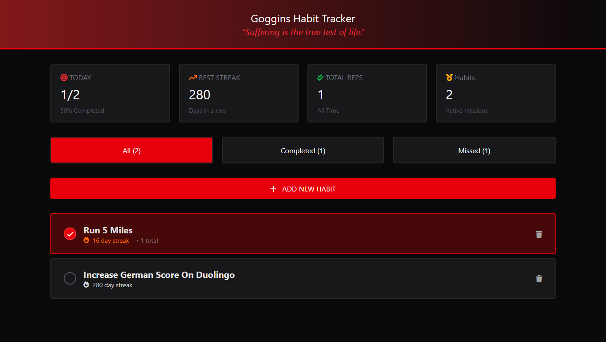

# 🪵 WHO'S GONNA CARRY THE BOATS? AND THE LOGS!!

A **Goggins-inspired Habit Tracker** built to keep you accountable when motivation dies.

This project helps you **track your habits, streaks, and consistency**, while getting punched in the face (lovingly) by **David Goggins-style quotes** that remind you to stop making excuses and keep going.

No fluff.  
No comfort.  
Just discipline.

---

## 🔥 What is this?

This is a **Habit Tracker** designed for people who want to:

- Stay consistent
- Build mental toughness
- Visually see how far they’ve come
- Get motivated by **Goggins quotes** every time they open the app

Every habit tracked is a log.  
Every streak is proof.  
And **you’re carrying them all.**

---

## 🖼 Preview

---

## ⚙️ Features

- ✅ Add and track daily habits  
- 🔥 Streak system to show consistency  
- 🧠 Motivational Goggins-style quotes  
- 📊 Visual feedback on your discipline  
- 🌑 Clean dark UI  
- 💪 Built with focus on simplicity and grind

---

## 🛠 Built With

- HTML  
- CSS / Tailwind  
- Vanilla JavaScript  

No frameworks.  
No shortcuts.  
Just fundamentals.

---

## 🚧 Status

This project is **In Production**.  
Expect:

- Bug fixes  
- Better UI  
- More motivation  

---

## 🧠 Philosophy

> “You don’t need motivation.  
> You need discipline.”

This app exists to remind you:
**When your mind quits, your habits don’t.**

---

## 📌 Final Words

If you’re tired of starting over…  
If you want proof of your effort…  
If you’re ready to **carry the boats AND the logs**…

Then this tracker is for you.

Stay hard.
